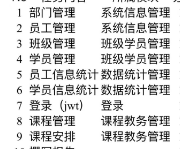

# 学生管理系统数据库设计



**系统字典表 (`sys_dict`)**

- `dict_type` (整数, 主键): 字典项的类型，0为根节点。
- `dict_value` (整数, 主键): 字典项的值，与dict_type联合作为主键。
- `dict_name` (字符串): 字典项的名称。
- `dict_path` (字符串): 从根节点到当前节点的路径。
- `status` (整数): 字典项是否启用，1为启用。

**文件表 (`files`)**

- `file_id` (整数, 主键, 自增): 文件的唯一标识符。
- `file_path` (字符串): 文件存储的路径。
- `upload_date` (日期时间): 文件上传的日期和时间。

**用户表 (`users`)**

- `phone` (字符串, 主键): 用户的手机号码，作为用户表的唯一标识。
- `password` (字符串): 用户密码,用于验证用户登录。
- `photo` (整数, 外键)：头像照片文件ID,关联到文件表。
- `status` (整数): 表示用户的状态，如是否启用,1为启用。
- `user_type` (枚举 'A', 'B'): 用户的类型，'A' 可以代表员工，'B' 代表学生。

**部门表 (`departments`)**

- `department_id` (整数, 主键, 自增): 用于唯一标识每个部门的自增主键。
- `department_name` (字符串, 唯一): 部门的名称，必须是唯一的。
- `description` (字符串): 关于部门的额外信息或备注。

**员工表 (employees)**

- `employee_id` (整数, 主键, 自增): 员工的唯一标识符。
- `phone` (字符串, 外键): 员工的手机号码，关联到用户表。
- `department_id` (整数, 外键): 员工所属部门的标识符。
- `name` (字符串): 员工的姓名。
- `role_type_id` (整数, 外键): 员工的角色类型标识符，关联到字典表。

**学员表 (students)**

- `student_id` (整数, 主键, 自增): 学生的唯一标识符。
- `phone` (字符串, 外键): 学生的手机号码，关联到用户表。
- `class_id` (整数, 外键): 学生所在班级的标识符。
- `name` (字符串): 学生的姓名。
- `date_of_birth` (日期): 学生的出生日期。
- `email` (字符串): 学生的电子邮件地址。

**班级表 (`classes`)**

- `class_id` (整数, 主键, 自增): 用于唯一标识每个班级的自增主键。
- `class_name` (字符串, 唯一): 班级的名称，必须是唯一的。
- `department_id` (整数, 外键, 引用`departments`表): 班级所属的部门的外键。
- `description` (字符串): 关于班级的额外信息或备注。

**课程表 (`courses`)**

- `course_id` (整数, 主键, 自增): 用于唯一标识每个课程的自增主键。
- `course_name` (字符串, 唯一): 课程的名称，必须是唯一的。
- `description` (字符串): 关于课程的额外信息或备注。

**课程安排表 (`course_schedules`)**

- `schedule_id` (整数, 主键, 自增): 用于唯一标识每个课程安排的自增主键。
- `course_id` (整数, 外键, 引用`courses`表): 该课程安排所对应的课程的外键。
- `class_id` (整数, 外键, 引用`classes`表): 该课程安排所对应的班级的外键。
- `start_time` (时间): 课程开始的时间。
- `end_time` (时间): 课程结束的时间。

## 建表SQL

```sql
USE edu_manage;

-- 系统字典表 (sys_dict)
CREATE TABLE `sys_dict` (
  `dict_type` INT NOT NULL,
  `dict_value` INT NOT NULL,
  `dict_name` VARCHAR(255) NOT NULL,
  `dict_path` VARCHAR(255) NOT NULL,
  `status` TINYINT(1) NOT NULL,
  PRIMARY KEY (`dict_type`, `dict_value`)
) ENGINE=InnoDB DEFAULT CHARSET=utf8mb4;

-- 文件表 (files)
CREATE TABLE `files` (
  `file_id` INT AUTO_INCREMENT PRIMARY KEY,
  `file_path` VARCHAR(255) NOT NULL,
  `upload_date` DATETIME NOT NULL
) ENGINE=InnoDB DEFAULT CHARSET=utf8mb4;

-- 用户表 (users)
CREATE TABLE `users` (
  `phone` VARCHAR(20) PRIMARY KEY,
  `password` VARCHAR(255) NOT NULL,
  `photo` INT,
  `status` TINYINT(1) NOT NULL,
  `user_type` ENUM('A', 'B') NOT NULL,
  FOREIGN KEY (`photo`) REFERENCES `files` (`file_id`)
) ENGINE=InnoDB DEFAULT CHARSET=utf8mb4;

-- 部门表 (departments)
CREATE TABLE `departments` (
  `department_id` INT AUTO_INCREMENT PRIMARY KEY,
  `department_name` VARCHAR(255) NOT NULL UNIQUE,
  `description` TEXT
) ENGINE=InnoDB DEFAULT CHARSET=utf8mb4;

-- 员工表 (employees)
CREATE TABLE `employees` (
  `employee_id` INT AUTO_INCREMENT PRIMARY KEY,
  `phone` VARCHAR(20),
  `department_id` INT,
  `name` VARCHAR(255) NOT NULL,
  `role_type_id` INT,
  FOREIGN KEY (`phone`) REFERENCES `users` (`phone`),
  FOREIGN KEY (`department_id`) REFERENCES `departments` (`department_id`)
) ENGINE=InnoDB DEFAULT CHARSET=utf8mb4;

-- 班级表 (classes)
CREATE TABLE `classes` (
  `class_id` INT AUTO_INCREMENT PRIMARY KEY,
  `class_name` VARCHAR(255) NOT NULL UNIQUE,
  `department_id` INT,
  `description` TEXT,
  FOREIGN KEY (`department_id`) REFERENCES `departments` (`department_id`)
) ENGINE=InnoDB DEFAULT CHARSET=utf8mb4;

-- 学员表 (students)
CREATE TABLE `students` (
  `student_id` INT AUTO_INCREMENT PRIMARY KEY,
  `phone` VARCHAR(20),
  `class_id` INT,
  `name` VARCHAR(255) NOT NULL,
  `date_of_birth` DATE NOT NULL,
  `email` VARCHAR(255),
  FOREIGN KEY (`phone`) REFERENCES `users` (`phone`),
  FOREIGN KEY (`class_id`) REFERENCES `classes` (`class_id`)
) ENGINE=InnoDB DEFAULT CHARSET=utf8mb4;

-- 课程表 (courses)
CREATE TABLE `courses` (
  `course_id` INT AUTO_INCREMENT PRIMARY KEY,
  `course_name` VARCHAR(255) NOT NULL UNIQUE,
  `description` TEXT
) ENGINE=InnoDB DEFAULT CHARSET=utf8mb4;

-- 课程安排表 (course_schedules)
CREATE TABLE `course_schedules` (
  `schedule_id` INT AUTO_INCREMENT PRIMARY KEY,
  `course_id` INT,
  `class_id` INT,
  `start_time` TIME NOT NULL,
  `end_time` TIME NOT NULL,
  FOREIGN KEY (`course_id`) REFERENCES `courses` (`course_id`),
  FOREIGN KEY (`class_id`) REFERENCES `classes` (`class_id`)
) ENGINE=InnoDB DEFAULT CHARSET=utf8mb4;
```

## 系统字典表设计说明

### 表名称

**`sys_dict`**

### 功能描述

这是一个采用树结构设计的系统字典表，用于存储具有层级关系的字典数据。它使用`dict_type`和`dict_value`作为联合主键，并通过`dict_path`字段来表示节点之间的层级路径。

### 字段说明

- **dict_type** (整数, 非空): 字典类型，0表示根节点，其他值表示父级的`dict_value`。
- **dict_value** (整数, 非空): 字典值，存储实际数据，与`dict_type`组合作为联合主键。
- **dict_name** (字符串, 非空): 字典名称，存储字典项的名称。
- **dict_path** (字符串, 非空): 字典路径，存储从根节点到当前节点的路径，格式为'root/child/grandchild'。
- **status** (整数, 非空): 状态，标识字典项是否启用，1表示启用，0表示禁用。

### 约束和索引

- **联合主键**：`dict_type`和`dict_value`组合成为表的联合主键。
- **索引**：可以考虑为`dict_path`字段添加索引，以优化基于路径的查询性能。

## 数据库初始化

mysql -u root -p

**创建数据库**

CREATE DATABASE edu_manage;

** 查看所有数据库**

 SHOW DATABASE;

**批量建表**

mysql -u root -p -h localhost edu_manage  < "C:\Users\HaoTian\Desktop\create_tables.sql"
